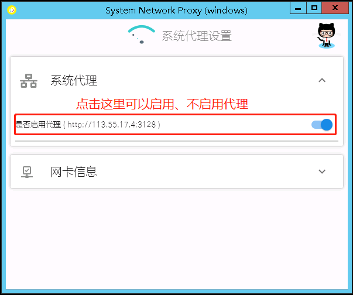
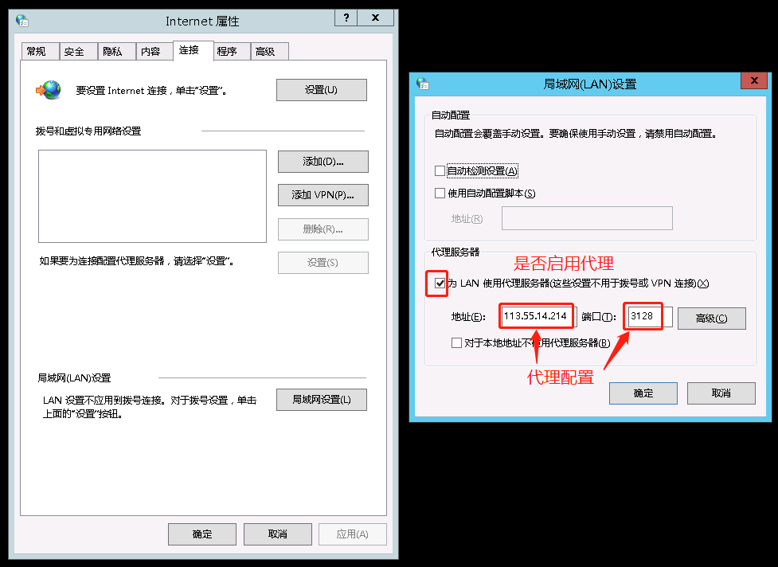
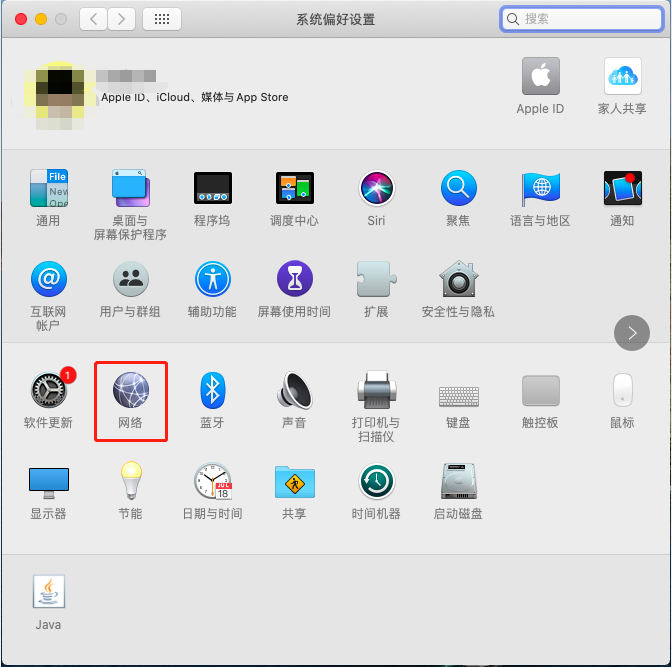
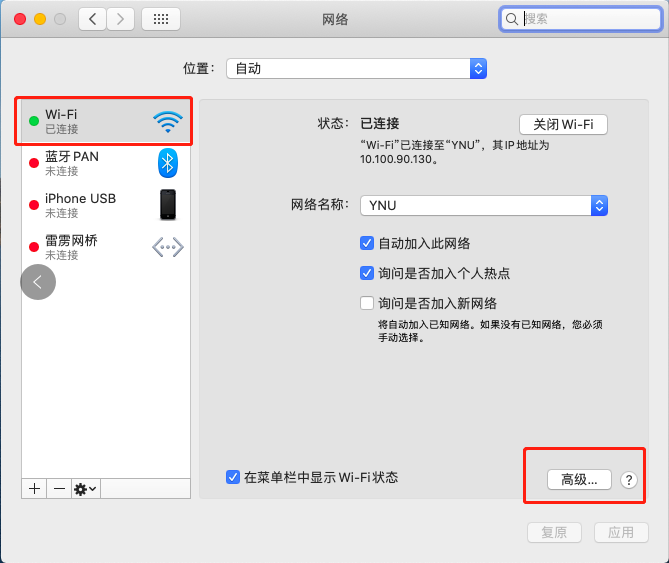
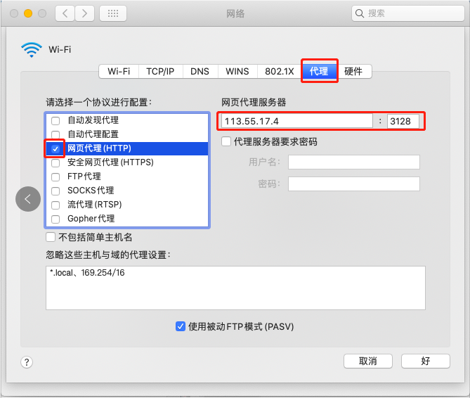

# system_network_proxy_ynu

云南大学网络免费代理

## 原理

此`app`的实现的是通过图形界面设置（启用、不启用）系统全局代理（具体实现细节是通过修改注册表），代理地址是`http://113.55.17.4:3128`（使用 squid3 搭建的代理服务器，其中可访问的域名白名单见 https://github.com/liudonghua123/ynu-domain-crawler ），对电脑设置较熟悉的也可以手动设置，设置方式见下文。

## app 使用教程

此`app`使用非常简单，访问 https://github.com/liudonghua123/system_network_proxy_ynu/releases 下载最新版本的`Setup.exe`，点击安装之后会自动在桌面创建 `system_network_proxy_ynu`快捷方式，并且运行此 app，下次打开可以通过桌面快捷方式打开，运行后的界面如下

## 手动设置代理方式

### `windows`代理设置

依次通过`控制面饭`-`网络和 Internet`-`Internet 选项`-`连接`或运行`control inetcpl.cpl,,4`打开如下对话框

点击`局域网设置`，然后可以勾选或取消勾选`为LAN使用代理服务器`，然后设置地址为`113.55.17.4`，端口为`3128`；勾选上表示使用代理，取消勾选表示不使用代理。

### `macos`代理设置

1. 打开`系统偏好设置`；

2. 在系统偏好设置中打开`网络`设置；

3. 在`网络`设置中选中已连接的网络（一般是 Wi-Fi 连接 YNU 热点），然后点击`高级`；

4. 在弹出的高级对话框中选择`代理`Tab，然后勾选上`网页代理(HTTP)`，右边如图所示填写`113.55.17.4`、`3128`，勾选上`网页代理(HTTP)`表示启用代理，取消勾选表示不启用代理；

## Todos

- [ ] 持续完善`app`设计及用户体验
- [x] 添加 Linux 支持
- [x] 添加 Macos 支持
- [ ] 添加 android 支持
- [ ] 添加 ios 支持

## 欢迎 Issues/PR

此 app 仅仅是为了方便不熟悉电脑以及命令行界面的用户提供启用、不启用代理设置的，在使用过程中如果有问题或建议，可以提交[issues](https://github.com/liudonghua123/system_network_proxy_ynu/issues)或者[Pull requests](https://github.com/liudonghua123/system_network_proxy_ynu/pulls).

## LICENSE

MIT License

Copyright (c) 2020 liudonghua
