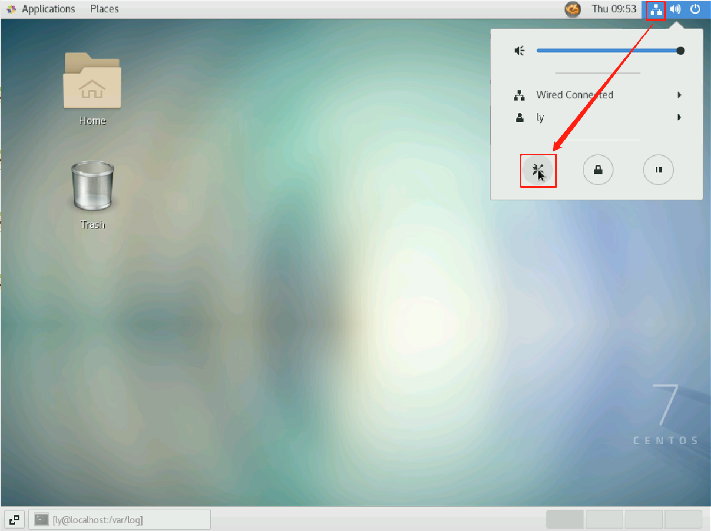

# system_network_proxy_ynu

云南大学网络免费代理

## 原理

此`app`的实现的是通过图形界面设置（启用、不启用）系统全局代理（具体实现细节是 windows 通过修改注册表，macos、linux 通过执行代理设置命令，可参考 https://github.com/liudonghua123/system_network_proxy ），代理地址是`http://113.55.17.4:3128`（使用 squid3 搭建的代理服务器，其中可访问的域名白名单见 https://github.com/liudonghua123/ynu-domain-crawler ），如果使用 app 有问题也可以手动设置，设置方式见下文。

## app 使用教程

此`app`使用非常简单，访问 https://github.com/liudonghua123/system_network_proxy_ynu/releases/latest 下载最新版本的`Setup.exe`，点击安装之后会自动在桌面创建 `system_network_proxy_ynu`快捷方式，并且运行此 app，下次打开可以通过桌面快捷方式打开，macos、linux 分别下载文件名中带有 macos、linux 的 zip 文件，运行后的界面如下

## 手动设置代理方式

### `windows` 代理设置

依次通过`控制面饭`-`网络和 Internet`-`Internet 选项`-`连接`或运行`control inetcpl.cpl,,4`打开如下对话框

点击`局域网设置`，然后可以勾选或取消勾选`为LAN使用代理服务器`，然后设置地址为`113.55.17.4`，端口为`3128`；勾选上表示使用代理，取消勾选表示不使用代理。

### `macos` 代理设置

1. 打开`系统偏好设置`；

   

2. 在系统偏好设置中打开`网络`设置；

   

3. 在`网络`设置中选中已连接的网络（一般是 Wi-Fi 连接 YNU 热点），然后点击`高级`；

   

4. 在弹出的高级对话框中选择`代理`Tab，然后勾选上`网页代理(HTTP)`，右边如图所示填写`113.55.17.4`、`3128`代理配置信息，勾选上`网页代理(HTTP)`表示启用代理，取消勾选表示不启用代理；

   

### `linux` 代理设置（GNOME3 桌面为例）

1. 点击右上角的网络，然后点打开`网络设置`；

   

2. 在网络设置左边选择`Network`，点击右边`Network Proxy`旁边的设置小齿轮；

   

3. 在弹出的`Network Proxy`对话框中选择`Manual`，然后在`HTTP Proxy`一栏中填写`113.55.17.4`、`3128`代理配置信息，选择`Manual`并且配置代理后表示启用代理，选择`Disabled`表示不启用代理；

   

### `android` 代理设置（华为桌面为例）

1. 打开`系统设置`，然后打开`WLAN`；

   

2. 在`WLAN`设置中**长按**已连接的 Wi-Fi 热点（例如这里的 YNU），选择`修改网络`；

   

3. 在弹出的`修改网络`对话框中勾选`显示高级选项`，然后点击`代理`，选择`手动`，然后填写`113.55.17.4`、`3128`代理配置信息，选择`手动`并且配置代理后表示启用代理，选择`无`表示不启用代理；

   

### `ios` 代理设置（ios 14 为例）

1. 打开`系统设置`，然后点击`无线局域网`；

   

2. 在`无线局域网`中点击已连接的 Wi-Fi 热点（例如这里的 YNU）旁边的`感叹号`设置按钮；

   

3. 在弹出的设置界面最下面点击`配置代理`；

   

4. 在弹出的`配置代理`中选择`手动`，然后填写`113.55.17.4`、`3128`代理配置信息，选择`手动`并且配置代理后表示启用代理，选择`关闭`表示不启用代理；

   

## Todos

- [ ] 持续完善`app`设计及用户体验
- [x] 添加 linux 支持（实验性）
- [x] 添加 macos 支持（实验性）
- [ ] 添加 android 支持
- [ ] 添加 ios 支持

## 欢迎 Issues/PR

此 app 仅仅是为了方便不熟悉电脑以及命令行界面的用户提供启用、不启用代理设置的，在使用过程中如果有问题或建议，可以提交[issues](https://github.com/liudonghua123/system_network_proxy_ynu/issues)或者[Pull requests](https://github.com/liudonghua123/system_network_proxy_ynu/pulls).

## LICENSE

MIT License

Copyright (c) 2020 liudonghua
